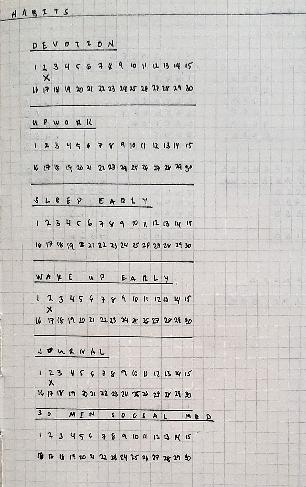
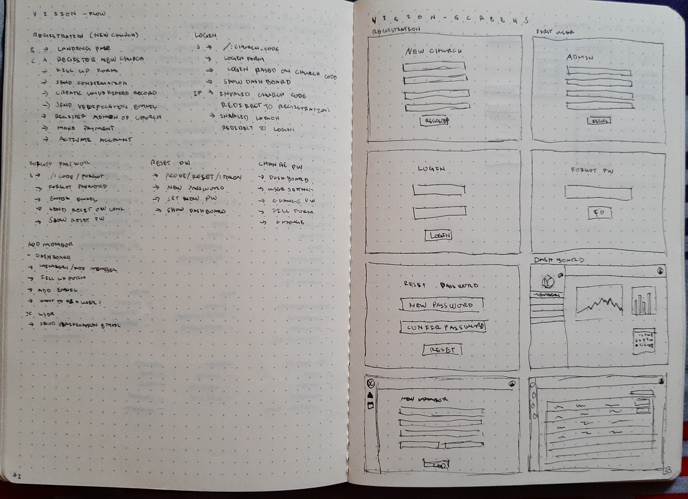
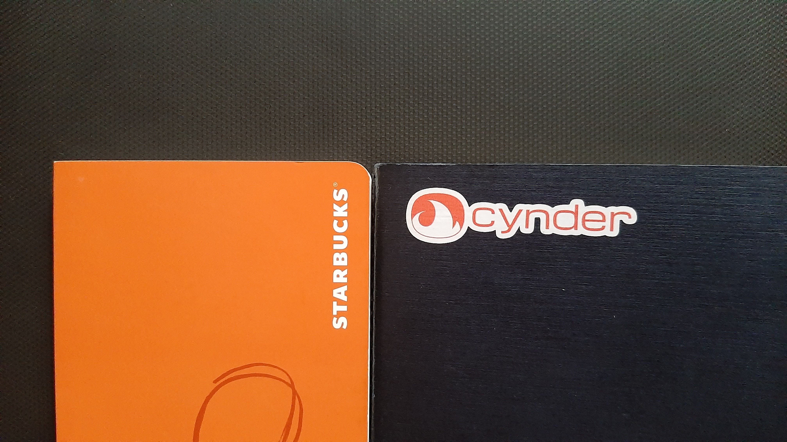

Are you the kind of person who is not organized? Or a person who hardly plans for something unless it is really important? Someone whose thoughts are scattered, someone who just really need clarity? Well, you and I are alike. I missed a lot of deadlines, failed to do lots of tasks and even forgot numbers of important events.

Recently, I’ve been having a hard time keeping track of the stuff that I have to do, ideas that come up or important dates I need to prepare for. I can't keep all this information inside my head, otherwise, I won't know what to prioritize, and worse, just straight-up forget them.  So I need to have a ***permanent record*** and be able to control the flow of the new stuff, which led me to the good old-fashioned ***note-taking***.

As a tech enthusiast and a developer, I tend to lean on to using Applications that are both accessible on any device that I have. I've tried several apps to be my main note-taking tool, apps such as *Evernote*, *OneNote*, and *Google Keep*, they're all great and functional but somehow, it doesn't work for me. The reason? I always get ***distracted*** with the other stuff on my devices, such as social media, notifications, emails, messages, and games. That's when I realized that I needed something non-digital.

Fortunately, I stumbled upon this system described as ***"Analog method for the digital age"*** developed by *Ryder Carroll* [(@rydercarroll)](https://twitter.com/rydercarroll), called **The Bullet Journal Method**

**The Bullet Journal Method** is a system composed of several modules that work together to be a robust, productive and efficient way to take down your notes. According to Ryder, it is a system he designed to *__track__ the past, __organize__ the present, and __plan__ for the future*. You can watch the video below to have an idea of how it works.

<iframe width="560" height="315" src="https://www.youtube.com/embed/fm15cmYU0IM" frameborder="0" allow="accelerometer; autoplay; encrypted-media; gyroscope; picture-in-picture" allowfullscreen></iframe>

 

There are a lot of ways that a bullet journal can be used and it is not limited by a set of rules, you can customize it however you want. If you look in Pinterest or Instagram about bullet journals, you'll find varieties of unique ways the people use them. As for me, I started with the basics, I browsed for some ideas from the net. I've tried some and found out what worked or won't for me.

And now I'll share with you how I use my bullet journal and how I set it up for November.

1. **Daily Logs**

    The main purpose of doing this journal is I use it to track my tasks and other things I need to remember. Before I've been using 2 pages for each week where the first page was divided for Monday to Wednesday and the other is for Thursday to Sunday. For November, I'll go back to the basic daily logs, as it'll require less paper real-estate from my previous setup.

2. **Budget, Income and Expense Tracker**

    One of my lifetime goals is to have financial freedom and one of the things every financial adviser would agree is that you should learn how to manage your finances. As a step towards this goal, I've decided to include this practice in my journal to keep all my self-development practices in the same place. I’ve tried several setups for this page, and I’m on my fourth iteration for this collection.

    

3. **Monthly Overview**

    There's not much about this page other than I’m using this section to track all of the important dates for the month, I've also moved the monthly task list to the bottom of the calendar, since I rarely use it and use the next page for something else.

    
    

4. **Habit Tracker**

    Self-development heavily involves forming good habits and breaking bad ones *(I need to break a lot)*. I use this page to track my progress of my habits. I used to have this on the rightmost side of my monthly overview calendar.

    

5. **Custom Collections**

    I use collections for notes or tasks that are related to one topic maybe a project, blog ideas, my budget and habit trackers, etc. I list all of my custom collections on the index.

    

I hope you learned a thing or two from this post. I am by no means an expert when it comes to bullet journaling, self-development, and finances. as I am still learning how to improve and master this system in a way that works for me. If you are in the same situation, I encourage you to give Bullet Journaling a try, you can learn more about it at [bulletjournal.com](https://bulletjournal.com).

If you have questions regarding this post or suggestions on how can I improve my blog, feel free to send me an email [here](mailto:periabytes@gmail.com)
