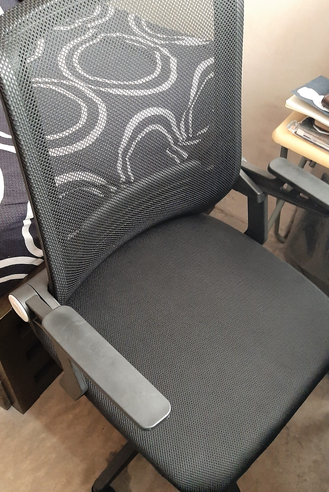
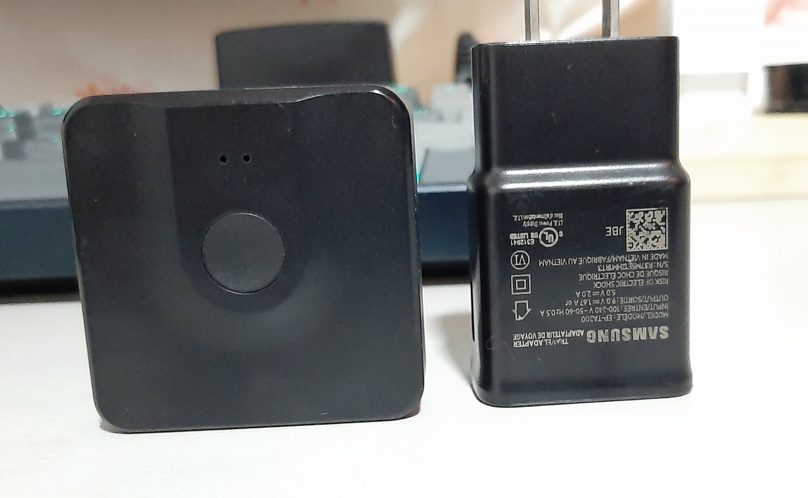

With the threat of the Coronavirus(COVID-19), a lot of companies transitioned from the traditional office arrangement to a Work From Home(WFH) setup. But we at [CynderTech](https://www.cynder.io/), we already have a 1-day WFH or Remote Work even before the pandemic so I already have a dedicated table for work, and have been trying to improve it gradually for quite a while now.

### **The Problem**

My work station is composed of a simple table, a standard desktop, a laptop, and a monobloc chair. My table, the same as any other surface area in everybody's house, tends to get cluttered over time. My chair is very rigid and short and offers little comfort. All of these things combined contribute to low productivity and motivation over time. At the start of the pandemic, it is one of the problems I've encountered in this "new normal" setup.

Since there's still no vaccine for the coronavirus it looks like this arrangement is going to stay for quite a while. I need to improve my workstation just so I can improve my productivity with this setup.

### **The Solution**

#### **Decluttering**

As I said above any surface area is prone to be cluttered over time, it is one of the things I learned from the YouTuber [Matt D'Avella](https://www.youtube.com/user/blackboxfilmcompany). And it is obviously the first thing to do when we're trying to change a place or a spot. This also applies to the mind, but that's a topic for another day.

What I did was I removed most of the things that I don't usually use in my daily work. I also put the things I occasionally need in a plastic storage box under my desk. And with the desk free of clutter, It is ready for more changes.

I managed to acquire more surface area by moving my desktop's system unit from the main table to a smaller side table which was originally a laptop table. I also put my speakers, my gaming controller, and my notebooks there.

#### **Improve workplace ergonomics**

Back Pain is one of the most common problems with desk workers like us IT professionals. It can be addressed through improving your workplace ergonomics. In my situation, it is slightly modifying my workplace to be as efficient as possible by removing distractions and obstructions, improving comfort and posture. The following are the things I needed to address in my current setup.

##### **1. Work Chair**

A monobloc chair, you've guessed it, is not ergonomic. Because of its rigid structure, there is little to nothing that you can do to make it comfortable enough for an extended period of use.

As a solution, I needed to replace the monobloc chair with a proper ergonomic office chair. Luckily, I found this really affordable, office chair through Facebook Marketplace. It has an adjustable height, comfortable mesh material, and wheels only for PHP 1890 it is way better than your typical PHP 2000 office chairs from furniture shops in shopping malls. I also used the plastic storage box under the table as a footrest for a better sitting position.

##### **2. Monitor Mount**

My monitor came with a stand which is attached on the back, it has a medium-sized circular base, the problem is while it is medium-sized, my desk is small-sized in width so my surface area is limited, the stand's base occupies almost half of the table's width. As a result, I can barely place a notebook in front of me when the monitor and the keyboard are there.

The solution I thought of is a monitor mount that I can attach at the side of the table and preferably, also adjustable. I found this fair priced monitor mount at Lazada for PHP 1270, that price might be expensive for some people, but when you think about it, you're not going to replace it every month or every year, so you'll be using it for a long time.

As I said earlier, I prefer that the monitor mount I would buy is adjustable, not just the angle but also the height or elevation. Ideally, the monitor height should be eye-level so that it won't cause neck pain and you'll be able to maintain a proper posture while using the monitor. The monitor should adjust rather than your posture.

##### **3. Power strip**

A digital setup always requires a place where you could plug things in, before this change, my power strip was under the table causing me to bend over when I need to plug something, with the additional real-estate I earned by using a monitor mount, I was able to place the power strip on the table where I could plug things with minimal effort.

#### Extra Items

Here are some items that I bought to improve my workflow

-   **Keychron K2** - a Bluetooth mechanical keyboard that can be paired with another 3 devices and switch between them with ease without having to deal with cables, which is useful because I use both Windows and macOS.

-   **Logitech MX Master 2S** - a multidevice mouse which I can also use on both Windows and macOS. It has the same purpose as the keyboard and it also helps me scroll through lines of code with ease.

-   **TP-Link Deco E4** - a mesh-enabled WiFi router to get reliable connectivity everywhere in the house, because my previous router broke down.

-   **UGREEN HDMI Splitter Switch** - to easily switch video output from both the desktop and the laptop by pressing a single button.

-   **Velcro Cable Ties** - everybody loves good cable management, velcro ties enable you to do that and it is reusable, unlike zip ties.

#### Things for improvement

Currently, these are the things that I've identified to be improved

-   An elevated laptop stand would be great because both the laptop screen and the second screen would be at the same level.
-   Better power strip as I'm still unsatisfied how it is currently setup.

#### And that's it for now

I know there are still a lot of ways to improve my current workstation, but the way it is now is a lot better from the way it was. I can already feel the benefits of the monitor mount and the ergonomic chair while writing this blog.

What about you what are the things you did to your workstation to improve your productivity?

###### If anyone is interested here are the products that I mentioned above.

-   [Loop Alloy Single LED Monitor Mount](https://www.lazada.com.ph/products/loop-alloy-single-led-monitor-mount-bracket-grommet-gas-lift-14-32-7kg-capacity-i120630941-s125367122.html?mp=1)
-   [Ergonomic Chair](https://www.facebook.com/marketplace/item/298677917814815)
-   [Keychron K2](https://www.henyoshop.com/store/k2-gateron-brown-rgb-aluminumframe?c=5ecd111306865)
-   [Logitech MX Master 2s](https://shopee.ph/product/25952313/1086706120)
-   [TP-Link Deco E4](https://www.lazada.com.ph/products/tp-link-deco-e4-ac1200-whole-home-mesh-wi-fi-system-3-pack-seamless-roaming-mesh-wifi-80211-kvr-supported-mesh-router-tp-link-tplink-i364130340-s824146562.html?mp=1)
-   [UGREEN HDMI Splitter Switch](https://www.lazada.com.ph/products/ugreen-hdmi-splitter-switch-bi-direction-4k-hdmi-switcher-1x22x1-adapter-2-in-1-out-converter-for-ps43-tv-box-intl-i290516992-s471398312.html)
-   [Velcro Cable Ties](https://www.lazada.com.ph/products/ugreen-5pcs10pcs20pcs-cable-tie-wire-winder-nylon-tape-14cm-for-mouse-cord-earphone-hdmi-aux-usb-cable-management-wire-organizer-i267276100-s378194917.html)
