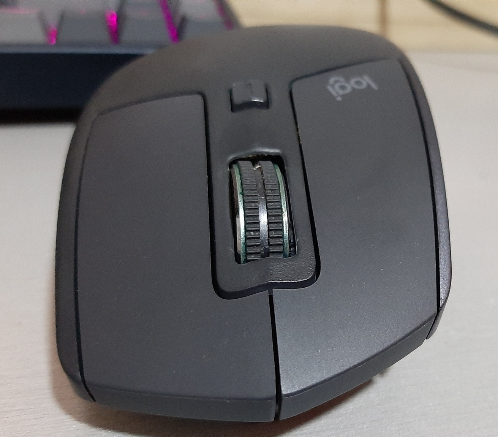
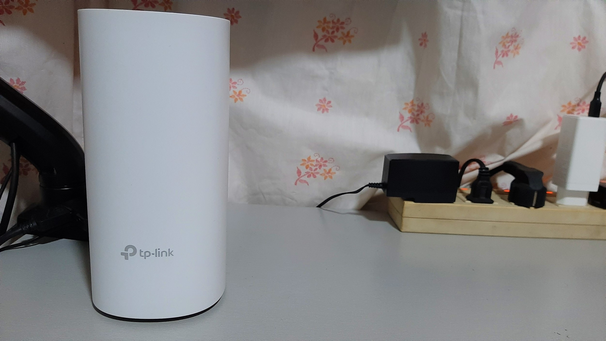

#### In online shopping, there are a lot of choices and sometimes there are items you are not able to see, that you might find useful. Here are some of those items that I found.

**_Disclaimer: I am in no way associated with the stores or brands that sell these items._**

1. [**Xiaomi Noise-Cancelling Earphones**](https://www.lazada.com.ph/lucky-hr-xiaomi-mi-noise-cancelling-in-ear-earphone-with-built-in-microphone-35-mm-earphones-headset-modeljzej02jy-i317298052-s653292829.html) - Noise-cancelling earphones for a fraction of price than the big brands like Apple and Sony, if having a cable is not an issue for you. I bought them before at P1,839, this time it is a little bit higher at **P1,989**

2. **Sandisk TYPE-C Ultra Dual 3.1 OTG USB Drive** - This one could be very useful if you need an OTG Flash Drive for your phone with USB Type-C port. It still has a standard USB 3.1 plug to plug it in your computer. You could get it at [P290(16GB)](https://www.lazada.com.ph/products/sandisk-sdddc2-16gb-type-c-ultra-dual-31-otg-usb-drive-i8855191-s11264129.html?spm=a2o4l.store_campaign.promotionWhatYouSee_933552589.1), [P434(32GB)](https://www.lazada.com.ph/products/sandisk-sdddc2-32gb-type-c-ultra-dual-31-otg-usb-drive-i100165592-s100196400.html?mp=3&spm=a2o4l.store_campaign.promotionCountdownProduct_933552591.0), [P609(64GB)](https://www.lazada.com.ph/products/sandisk-sdddc2-64gb-type-c-ultra-dual-31-otg-usb-drive-i207541713-s262852335.html?spm=a2o4l.store_campaign.promotionWhatYouSee_933552589.0)

3. [**UGREEN HDMI Splitter**](https://www.lazada.com.ph/ugreen-hdmi-splitter-switch-bi-direction-4k-hdmi-switcher-1x22x1-adapter-2-in-1-out-converter-for-ps43-tv-box-intl-i290516992-s471398312.html?spm=a2o4l.evaluation_my_review.0.0.76d53e17jJKgkN) - I've already mentioned this in my other [post](/blog/improving-work-from-home-setup), this is useful if you have a single monitor but have two sources, or vice-versa. You can get it for **P329** later at 4 pm.

4. [**SoundPeats TWS Earphones**](https://www.lazada.com.ph/shop/soundpeats-audio-store?spm=a2o4l.order_details.0.0.4f413e17BCCKjg) - There are a lot of good TWS earphones from this brand. They have overall great reviews for most of their products. This store offers a lot of vouchers for these items We've ordered 2 pairs of TruEngine SE and 1 Pair of TrueCapsule and we saved nearly P1000 combining their coupon, Lazada Wallet discount, and 6.6 Promo

#### Also here are some of the items on prior sales I've bought that I found you might want to add to your wishlist for future promotions and flash sales.

-   [**Ringke Foldable Laptop Stand**](https://www.lazada.com.ph/products/ringke-folding-stand-portable-and-foldable-laptop-stand-for-desktop-macbook-notebook-computer-ipad-tablet-i282802120-s439298225.html) - I've used this quite a lot before the COVID-19 pandemic at home, at the office, and the local coffee shop. it is a small laptop stand to give some elevation on your machine. What's best about it is you can flatten it like a piece of paper and put it in your bag once you're done using it. And you don't need to stick it at the base of your laptop, unlike similar products.

-   [**Logitech MX Master 2S**](https://shopee.ph/product/25952313/1086706120) - I've mentioned it before this is a great productivity tool it is one of the top-rated mice in Logitech's arsenal. Other stores are also offering this, just find one with the lowest price.

-   [**TP-Link Deco E4**](https://www.lazada.com.ph/products/tp-link-deco-e4-ac1200-whole-home-mesh-wi-fi-system-3-pack-seamless-roaming-mesh-wifi-80211-kvr-supported-mesh-router-tp-link-tplink-i364130340-s824146562.html?mp=1) - There are a lot of Deco products from TP-Link but this one is the most affordable and cost-effective for most people. It provides great connectivity for your WiFi network.

-   [**LOOP ALLOY Single LED Monitor Mount**](https://www.lazada.com.ph/products/loop-alloy-single-led-monitor-mount-bracket-grommet-gas-lift-14-32-7kg-capacity-i120630941-s125367122.html?mp=1&spm=spm%3Da2o4l.order_details.item_title.1) - This is a great monitor mount for the price, it is of high quality and cheap. I got this at **P1270**.

-   [**Baseus 65W GaN Charger**](https://www.lazada.com.ph/products/baseus-wall-charger-gan-quick-travel-charger-65w-i535444519-s1439578573.html?spm=a2o4l.searchlist.list.9.e3fb15b8Cobjb2&search=1) - This one is enough to charge your USB Type-C laptop and 2 other devices at the same time, and only occupy a single socket. I've got a different version from this one but still has the same functionality. I got this at **P1499**.

If you like this post, please like and follow my [Facebook Page](https://www.facebook.com/PeriabyteTech) for more updates like this.
